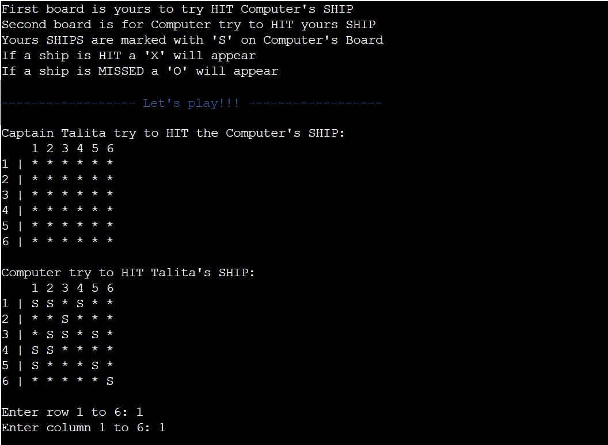
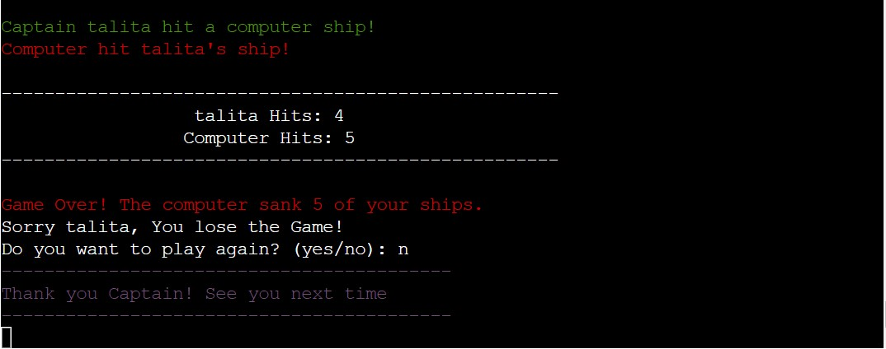
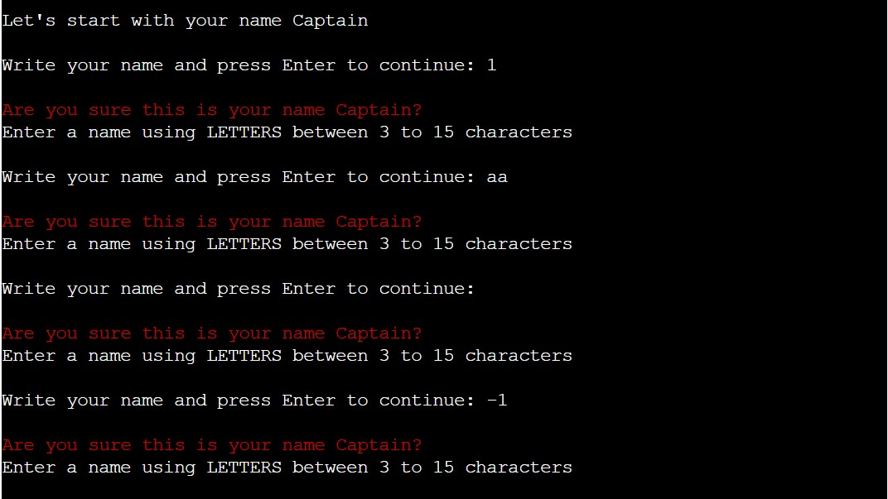
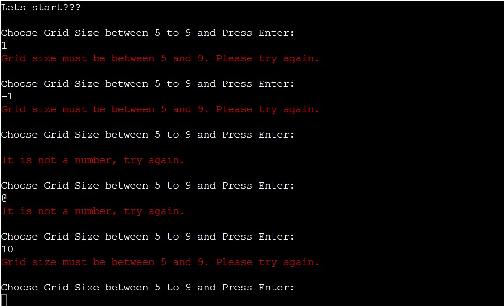

# Battleships Game - (In development)

As a programming enthusiast, I decided to create my own version of the classic game, Battleships, using Python Essentials for the Course at Code Institute. The game requires strategic guessing of ship locations and is designed for two players - the user and the computer. Each player has their own board, where ships are randomly placed. The objective is to destroy the computer's fleet before it destroy yours.

It's a popular game played all over the world, and you can learn more about it on [Wikipedia](https://en.wikipedia.org/wiki/Battleship_(game)) if you're interested.

[View the live project here](https://battleships-jogo-5dc3cf77bd06.herokuapp.com/)

## How To Play

- In this version, the player enters their name and a qustion about the grid size is made.
- The player have to choose the Grid Size between 5 to 9.
- Based on the size of the grid selected by the player, the ships will be shown. The number of ships will always be twice the size of the grid. For example, if the player selects a grid size of 5, there will be 10 ships displayed on both the player's and computer's boards. If the grid size is 6, then 12 ships will be shown on both boards and so on.
- The Player can view the location of their own ships denoted by **S**, but they won't be able to see where the computer's ships are placed.
- After all the ships are placed, each player takes turns trying to guess where the other player's ships are located on the board.
- Guesses are marked on the board with an **O** and Hits are marked with a **X**.
- The first to destroy 5 ships wins the game.

[Back to top ⇧](#battleships-game)

## UX

### User Demographic

- **The target audience of this game is:**

    - New user
    - Current user

- **Demographic:**

    - All ages
    - All puzzle playing levels

- **Psychographic:**

    - Lifestyles:
        - Interest in games
        - Interest in battles
    - Personality/Attitudes:
        - Focused
        - Creative

### New User Goals

1. New Users are looking for clear instructions on how to play the game.
2. They want to see a visual representation of whether the shot hit or missed a ship.
3. They want to see a scoreboard that shows who is winning.
4. New Users want the ability to replay the game.

### Current User

1. Current users want the ability to replay the game.
2. Current users want to be able to choose a grid size that raises the game's difficulty level.
3. They want a visual representation of whether the shot hit or missed a ship.
4. They want the ability to replay the game.

### Scope

The scope of the project involves defining requirements based on user goals. The required features have been categorized based on the goals of new and current users:

- Content Requirements:
    - The user will be looking for:
        - Clear and concise instructions.
        - A consistent game play.
- Functionality Requirements:
    - The user will be able to:
        - Enter co-ordinates using numbers.
        - Replay the game.
        - End the program at the end of the game.

### Structure

The project will be deployed to a Heroku terminal. There will be no styling.

### Skeleton

A flowchart was created to clearly illustrate the logical sequence that the functions will follow.

Flowchart

    

[Back to top ⇧](#)

## Features

### Existing Features

#### The Welcome Message to Battleships Game

- When a new game starts the welcome message is displayed.
- It also includes the user's goal and the number of HITs needed to win the game.
- The player is then prompted for name input. 

#### The Grid Size

- Once the player has entered their name, they will be prompted to select the size of the grid.
- The player is required to select a grid size ranging from 5 to 9.
- The number of ships on both boards is determined by the grid size, with twice the number of ships as the grid size. For example, if the grid size is 5, there will be 10 ships displayed Randomly on both boards.

#### The Boards

- After selecting the grid size, the player will receive information about the First and Second boards, and how the boards will be marked.
- The First Board is for the player to try to sink the computer's ships, which are hidden, so players cannot see where they are located.
- On the second board, the player's ships are visibly marked with the letter **S** to indicate their location. It is the computer's objective to attempt to sink these ships during gameplay.
- On both game boards, a ship that has been successfully sunk is marked with an **X**, while an unsuccessful attempt is marked with an **O**. These visual indicators allow players to keep track of their progress.
- At the bottom of the board, the player will be prompted to enter the row and column using numbers, to attempt to sink the computer's ship.

- After the player selects a row and column, the result of whether the player or computer hit or missed a ship is displayed.
- The scoreboard is displayed counting the hits made by both, Computer and Player.
- The game will continue until the Player or Computer hits 5 ships belonging to their opponent.

#### The End of the Game

- When Computer or Player HIT 5 ships of the opponent, the Game is Over.
- A Game Over message will be displayed and Player will be asked if they want to Play Again.
- If the player chooses to play again, the welcome message will be displayed and the game will start again.
- If the player chooses not to play again, a message saying **Thank you Captain! See you next time** will appear and the game will stop.

### Input validation and error-checking

Valid information must be input by the player to proceed. The input process will persist until all necessary information is provided. The following inputs will be repeated until the player fills them with the correct information:

- The Player Name on the Welcome Message, input is repeated until a valid name is entered.:

- The Grid Size choice, input is repeated until player choose a grid size between 5 to 9:

...............

### Future Features

- Allow Player to position ships themselves
- Have ships larger than 1x1

## Data Model

- llllll

## Testing

- llll

### Bugs

#### Solved Bugs

- lllll
#### Remaining Bugs

- jjjjjjj

#### Validator Testing

- lllll

## Deployment

lllllll

## Credits

llllll