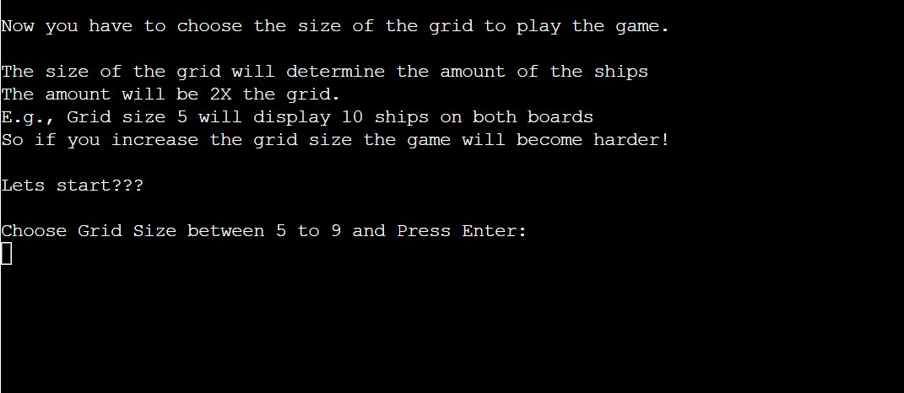
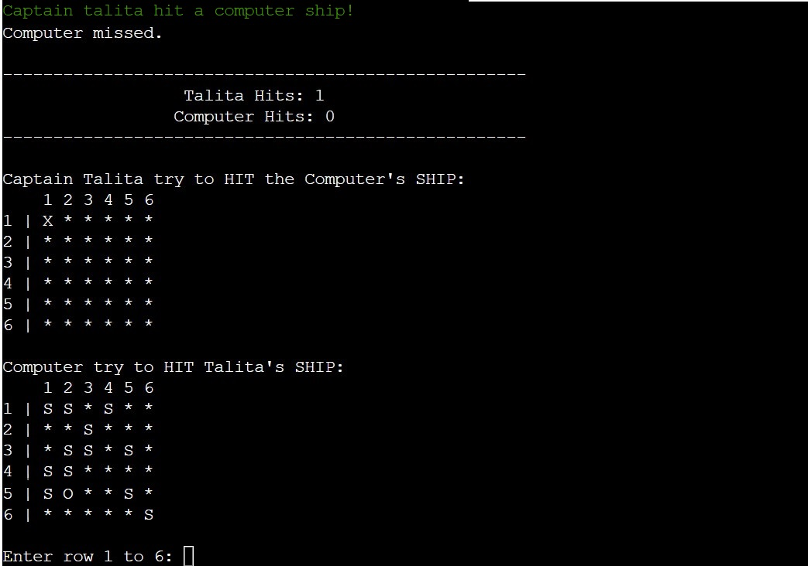

# Battleships Game

As a programming enthusiast, I decided to create my own version of the classic game, Battleships, using Python Essentials for the Course at Code Institute. The game requires strategic guessing of ship locations and is designed for two players - the user and the computer. Each player has their own board, where ships are randomly placed. The objective is to destroy the computer's fleet before it destroy yours.

It's a popular game played all over the world, and you can learn more about it on [Wikipedia](https://en.wikipedia.org/wiki/Battleship_(game)) if you're interested.

[View the live project here](https://battleships-jogo-5dc3cf77bd06.herokuapp.com/)

## Table of contents

1. [How to play](#how-to-play)
2. [UX](#ux)
    1. [User Demographic](#user-demographic)
    2. [New User Goals](#new-user-goals)
    3. [Current User](#current-user)
    4. [Scope](#scope)
    5. [Structure](#structure)
    6. [Skeleton](#skeleton)
3. [Features](#features)
    1. [Existing Features](#existing-features)
        - [The Welcome Message to Battleships Game](#the-welcome-message-to-battleships-game)
        - [The Grid Size](#the-grid-size)
        - [The Boards](#the-boards)
        - [The End of the Game](#the-end-of-the-game)
    2. [Input validation and error-checking](#input-validation-and-error-checking)
    3. [Future Features](#future-features)
4. [Technologies Used](#technologies-used)
    1. [Main Language](#main-language)
    2. [Frameworks, Libraries and Programs Used](#frameworks-libraries-and-programs-used)
5. [Testing](#testing)
    1. [Validator Testing](#validator-testing)
    2. [Bugs](#bugs)
        - [Solved Bugs](#solved-bugs)
        - [Remaining Bugs](#remaining-bugs)
6. [Deployment](#deployment)
    1. [Deploying on GitHub Pages](#deploying-on-github-pages)
    2. [GitHub Forking and Cloning](#github-forking-and-cloning)
    3. [Deploying on Heroku](#deploying-on-heroku)
7. [Credits](#credits)
    1. [Code](#code)
8. [Acknowledgements](#acknowledgements)

## How To Play

- In this version, the player enters their name and a qustion about the grid size is made.
- The player have to choose the Grid Size between 5 to 9.
- Based on the size of the grid selected by the player, the ships will be shown. The number of ships will always be twice the size of the grid. For example, if the player selects a grid size of 5, there will be 10 ships displayed on both the player's and computer's boards. If the grid size is 6, then 12 ships will be shown on both boards and so on.
- The Player can view the location of their own ships denoted by **S**, but they won't be able to see where the computer's ships are placed.
- After all the ships are placed, each player takes turns trying to guess where the other player's ships are located on the board.
- Guesses are marked on the board with an **O** and Hits are marked with a **X**.
- The first to destroy 5 ships wins the game.

[Back to top](#battleships-game)

## UX

### User Demographic

- **The target audience of this game is:**

    - New user
    - Current user

- **Demographic:**

    - All ages
    - All puzzle playing levels

- **Psychographic:**

    - Lifestyles:
        - Interest in games
        - Interest in battles
    - Personality/Attitudes:
        - Focused
        - Creative

### New User Goals

1. New Users are looking for clear instructions on how to play the game.
2. They want to see a visual representation of whether the shot hit or missed a ship.
3. They want to see a scoreboard that shows who is winning.
4. New Users want the ability to replay the game.

### Current User

1. Current users want the ability to replay the game.
2. Current users want to be able to choose a grid size that raises the game's difficulty level.
3. They want a visual representation of whether the shot hit or missed a ship.
4. They want the ability to replay the game.

### Scope

The scope of the project involves defining requirements based on user goals. The required features have been categorized based on the goals of new and current users:

- Content Requirements:
    - The user will be looking for:
        - Clear and concise instructions.
        - A consistent game play.
- Functionality Requirements:
    - The user will be able to:
        - Enter co-ordinates using numbers.
        - Replay the game.
        - End the program at the end of the game.

### Structure

The project will be deployed to a Heroku terminal. There will be no styling.

### Skeleton

A flowchart was created to clearly illustrate the logical sequence that the functions will follow.

Flowchart

    

[Back to top](#battleships-game)

## Features

### Existing Features

#### The Welcome Message to Battleships Game

- When a new game starts the welcome message is displayed.
- It also includes the user's goal and the number of HITs needed to win the game.
- The player is then prompted for name input.

#### The Grid Size

- Once the player has entered their name, they will be prompted to select the size of the grid.
- The player is required to select a grid size ranging from 5 to 9.
- The number of ships on both boards is determined by the grid size, with twice the number of ships as the grid size. For example, if the grid size is 5, there will be 10 ships displayed Randomly on both boards.

#### The Boards

- After selecting the grid size, the player will receive information about the First and Second boards, and how the boards will be marked.
- The First Board is for the player to try to sink the computer's ships, which are hidden, so players cannot see where they are located.
- On the second board, the player's ships are visibly marked with the letter **S** to indicate their location. It is the computer's objective to attempt to sink these ships during gameplay.
- On both game boards, a ship that has been successfully sunk is marked with an **X**, while an unsuccessful attempt is marked with an **O**. These visual indicators allow players to keep track of their progress.
- At the bottom of the board, the player will be prompted to enter the row and column using numbers, to attempt to sink the computer's ship.

- After the player selects a row and column, the result of whether the player or computer hit or missed a ship is displayed.
- The scoreboard is displayed counting the hits made by both, Computer and Player.
- The game will continue until the Player or Computer hits 5 ships belonging to their opponent.

#### The End of the Game

- When Computer or Player HIT 5 ships of the opponent, the Game is Over.
- A Game Over message will be displayed and Player will be asked if they want to Play Again.
- If the Player chooses to play again, the Welcome Message will be displayed and the game will start again.
- If the Player chooses not to play again, a message saying **Thank you Captain! See you next time** will appear and the game will stop.

### Input validation and error-checking

Valid information must be input by the player to proceed. The input process will persist until all necessary information is provided. The following inputs will be repeated until the player fills them with the correct information:

- The Player Name on the Welcome Message, input is repeated until a valid name is entered.:

- The Grid Size choice, input is repeated until player choose a grid size between 5 to 9:

- The Row and Column must be a number and be between the Grid Size chosen by the Player in the beginning of the game:

- When a player tries to use the same row and column as before, an error message appears, prompting the player to choose different coordinates:

[Back to top](#battleships-game)

### Future Features

- Allow Player to position ships themselves
- Have ships larger than 1x1

## Technologies Used

### Main Language

- [Python](https://en.wikipedia.org/wiki/Python_(programming_language) "Link to Python Wikipedia")

### Frameworks, Libraries and Programs Used

- [GitHub](https://github.com/ "Link to GitHub")
    GitHub was used to store the project after pushing.
- [Lucid](https://lucid.app/ "Link to Lucid homepage")
    Lucid was used to create a flowchart of information, making the logic of the game easily understood.
- [Am I Responsive?](http://ami.responsivedesign.is/# "Link to Am I Responsive Homepage")
    Am I Responsive was used to generate mock-up imagery of the terminal showing the game in use on Heroku.

[Back to top](#battleships-game)

## Testing

Testing has been an ongoing process throughout the project to identify and address any errors by following these steps:

- Running the program through the terminal and using the Python debugger.
- Run the program through the PEP8 validator to ensure it meets standards.
- Tested the game with invalid inputs, including Type Errors and Value Errors, as well as testing for out of bounds inputs and the same input twice.
- The game has also been tested in the CI Heroku terminal.
- Testing has been conducted by both myself and users, and currently, there are no reported issues that could cause the game to malfunction.

### Validator Testing

The [PEP8 Online Checker](https://extendsclass.com/python-tester.html/) service was used to validate the code.
**Results:**

Validation results

### Bugs

#### Solved Bugs

- During the initial stages of the project, a bug was discovered while attempting to differentiate between computer ships and user ships. The issue arose from not creating a separate class for the user's board. Instead, a general board class was used for display the grid and the coordinates and for the user, causing problems with the code's logic. To resolve this issue, I started a new code with a new class created specifically for the user's board, and the game began running correctly.
- .......................
- ..................
- .....................

#### Remaining Bugs

- There are no remaining bugs found.

[Back to top](#battleships-game)

## Deployment

### Deploying on GitHub Pages

To deploy this page to GitHub Pages from its GitHub repository, the following steps were taken:

 1. Log into GitHub or create an account.
 2. Locate the GitHub Repository.
 3. At the top of the repository, select Settings from the menu items.
 4. Scroll down the Settings page to the "Pages" section.
 5. Under "Source" click the drop-down menu labeled "None" and select "Main".
 6. Upon selection, the page will automatically refresh meaning that the website is now deployed.
 7. Scroll back down to the "Pages" section to retrieve the deployed link.

### GitHub Forking and Cloning

To fork and clone the project, you can get more information on  you will need to follow these steps:

1. Forking a GitHub repository.

    You might fork a project to propose changes to the upstream, or original, repository. In this case, it's good practice to regularly sync your fork with the upstream repository. To do this, you'll need to use Git on the command line.
    - Navigate to the repository you wish to fork.
    - In the top-right corner of the page, click Fork.
    - Under "Owner," select the dropdown menu and click an owner for the forked repository.
    - By default, forks are named the same as their upstream repositories. Optionally, to further distinguish your fork, in the "Repository name" field, type a name.
    - Optionally, in the "Description" field, type a description of your fork.
    - Click Create fork.

2. Cloning your forked repository.

    - Navigate to your forked repository.
    - Above the list of files, click 'Code'.
    - To clone the repository using HTTPS:
        - Under "Clone with HTTPS", click the copy icon (a clipboard).
    - To clone the repository using an SSH key, including a certificate issued by your organization's SSH certificate authority:
        - Click 'Use SSH', then click the copy icon.
    - To clone a repository using GitHub CLI:
        - Click 'Use GitHub CLI', then click the copy icon.
    - Open Git Bash.
    - Change the current working directory to the location where you want the cloned directory.
    - Type git clone, and then paste the URL you copied earlier. It will look like this:
        git clone https://hostname/YOUR-USERNAME/repo-name
    - Press Enter. Your local clone will be created.

### Deploying on Heroku

To deploy this project to Heroku from its GitHub repository, the following steps were taken:

1. In your repository, type "pip freeze > requirements.txt" to create the list of dependencies to the requirements.txt file. Save, commit and push your changes to GitHub.

2. Create an account with [Heroku](https://www.heroku.com/ "Link to Heroku site"), selecting Python as the 'Primary development language'.

3. Go to your emails and click the link to verify your email address. The link will bring you to a page where you can create a password. Create a password and log in.

4. On the dashboard, click the 'create new app' button. Enter a unique name for your app and select your region. Click 'Create App'.

5. Go to the settings tab and click 'Reveal Config Vars'. Enter PORT as the KEY value and 8000 as the VALUE value.

6. Click 'Add Buildpack' and select 'Python' and 'Nodejs'. Python must be on the top of the list. Click and drag the buildpacks to the correct positions if needed.

7. Go to the deploy tab and, under 'Deployment method', click 'GitHub' and then 'Connect to GitHub'.

8. In 'Connect to GitHub', search for the repository you wish to use, then click 'Connect'.

9. If you 'Enable Automatic Deploys', Heroku will rebuild the app every time you push a change to GitHub. You can also choose to manually deploy using the 'Deploy Branch' option. Heroku will build the app and when it is finished, click the 'View' button to open the terminal.

[Back to top](#battleships-game)

## Credits

- The [GitHub Docs - Fork a repo](https://docs.github.com/en/github-ae@latest/get-started/quickstart/fork-a-repo "Link to an article on GitHub Docs that explains how to clone and fork a repository") webpage was utilized for instructions on forking and cloning a repository, along with the Code Institute Deployment on Heroku topic. This information was utilized in the Deployment section of the README file.
- The [GitHub Docs - Configuring a push source](https://docs.github.com/en/pages/getting-started-with-github-pages/configuring-a-publishing-source-for-your-github-pages-site "Link to an article on GitHub Docs that explains how to deploy") webpage was utilized for instructions on deploying, along with the Code Institute Deployment topic.
- The Code Institute Deploying on Heroku topic, was utilized for instructions on creating an account and deploy on Heroku.
- The [Becky139](https://github.com/Becky139/Battleship/tree/main "Link to another student Readme") - ReadMe was utilized for reference for buinding the ReadMe.

[Back to top](#battleships-game)

### Code

Various sources were consulted to gain a better understanding of the code being implemented. The following sites were most frequently utilized:

- [Stack Overflow](https://stackoverflow.com/) - Link to Stack Overflow page.
- [W3Schools](https://www.w3schools.com/) - Link to W3Schools page.
- [Heroku](https://p3-battleships.herokuapp.com/) - Link to Code Institute game on Heroku.
- [Python Package Index](https://pypi.org/) - Link to Python Package Index page.
- [Pytlint Dev Documentation](https://pylint.readthedocs.io/en/latest/index.html) - Link to Pylint page.

[Back to top](#battleships-game)

## Acknowledgements

- .............................
............................
